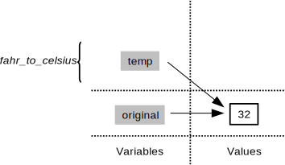
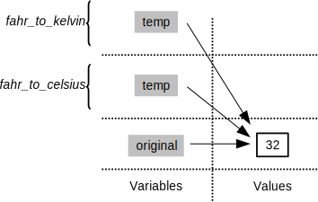

## Rules of Debugging

1.  Fail early, fail often.
2.  Always initialize from data.
3.  Know what it's supposed to do.
4.  Make it fail every time.
5.  Make it fail fast.
6.  Change one thing at a time, for a reason.
7.  Keep track of what we've done.
8.  Be humble.
9.  Test the simple things first.

And remember,
a week of hard work can sometimes save you an hour of thought.

## The Call Stack

Let's take a closer look at what happens when we call `fahr_to_celsius(32.0)`.
To make things clearer,
we'll start by putting the initial value 32.0 in a variable
and store the final result in one as well:

~~~
original = 32.0
final = fahr_to_celsius(original)
~~~
{: .language-python}

The diagram below shows what memory looks like after the first line has been executed:

When we call `fahr_to_celsius`,
Python *doesn't* create the variable `temp` right away.
Instead,
it creates something called a [stack frame]({{ page.root }}/reference/#stack-frame)
to keep track of the variables defined by `fahr_to_kelvin`.
Initially,
this stack frame only holds the value of `temp`:

When we call `fahr_to_kelvin` inside `fahr_to_celsius`,
Python creates another stack frame to hold `fahr_to_kelvin`'s variables:

It does this because there are now two variables in play called `temp`:
the parameter to `fahr_to_celsius`,
and the parameter to `fahr_to_kelvin`.
Having two variables with the same name in the same part of the program would be ambiguous,
so Python (and every other modern programming language) creates
a new stack frame for each function call
to keep that function's variables separate from those defined by other functions.

When the call to `fahr_to_kelvin` returns a value,
Python throws away `fahr_to_kelvin`'s stack frame
and creates a new variable in the stack frame for `fahr_to_celsius`
to hold the temperature in Kelvin:

It then calls `kelvin_to_celsius`,
which means it creates a stack frame to hold that function's variables:

Once again,
Python throws away that stack frame when `kelvin_to_celsius` is done
and creates the variable `result` in the stack frame for `fahr_to_celsius`:

Finally,
when `fahr_to_celsius` is done,
Python throws away *its* stack frame
and puts its result in a new variable called `final`
that lives in the stack frame we started with:

This final stack frame is always there;
it holds the variables we defined outside the functions in our code.
What it *doesn't* hold is the variables that were in the various stack frames.
If we try to get the value of `temp` after our functions have finished running,
Python tells us that there's no such thing:

~~~
print('final value of temp after all function calls:', temp)
~~~
{: .language-python}

~~~
---------------------------------------------------------------------------
NameError                                 Traceback (most recent call last)
<ipython-input-12-ffd9b4dbd5f1> in <module>()
----> 1 print('final value of temp after all function calls:', temp)

NameError: name 'temp' is not defined
~~~
{: .error}

~~~
final value of temp after all function calls:
~~~
{: .output}

Why go to all this trouble?
Well,
here's a function called `span` that calculates the difference between
the minimum and maximum values in an array:

~~~
import numpy

def span(a):
    diff = numpy.max(a) - numpy.min(a)
    return diff

data = numpy.loadtxt(fname='inflammation-01.csv', delimiter=',')
print('span of data:', span(data))
~~~
{: .language-python}

~~~
span of data: 20.0
~~~
{: .output}

Notice that `span` assigns a value to a variable called `diff`.
We might very well use a variable with the same name to hold data:

~~~
diff = numpy.loadtxt(fname='inflammation-01.csv', delimiter=',')
print('span of data:', span(diff))
~~~
{: .language-python}

~~~
span of data: 20.0
~~~
{: .output}

We don't expect `diff` to have the value 20.0 after this function call,
so the name `diff` cannot refer to the same thing inside `span` 
as it does in the main body of our program.
And yes,
we could probably choose a different name than `diff` in our main program in this case,
but we don't want to have to read every line of NumPy to see what variable names its functions use
before calling any of those functions,
just in case they change the values of our variables.

The big idea here is [encapsulation]({{ page.root }}/reference/#encapsulation),
and it's the key to writing correct, comprehensible programs.
A function's job is to turn several operations into one
so that we can think about a single function call
instead of a dozen or a hundred statements
each time we want to do something.
That only works if functions don't interfere with each other;
if they do,
we have to pay attention to the details once again,
which quickly overloads our short-term memory.

> ## Following the Call Stack
>
> We previously wrote functions called `fence` and `outer`.
> Draw a diagram showing how the call stack changes when we run the following:
>
> ~~~
> print(outer(fence('carbon', '+')))
> ~~~
> {: .language-python}
{: .challenge}

